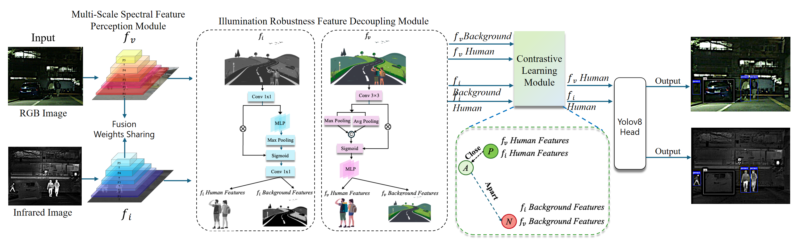

# PedDet

This is the code repository for the paper:
> **PedDet: Adaptive Spectral Optimization for Multimodal Pedestrian Detection**
> 
> Rui Zhao\*, [Zeyu Zhang](https://steve-zeyu-zhang.github.io/)\*†, Yi Xu, Yi Yao, Yan Huang, Wenxin Zhang, Zirui Song, Xiuying Chen, [Yang Zhao](https://yangyangkiki.github.io/)\**
>
> \*Equal contribution. \**Corresponding author. †Project lead.
> 
> [**[arXiv]**](https://arxiv.org/abs/2502.14063) [**[Paper with Code]**](https://paperswithcode.com/paper/peddet-adaptive-spectral-optimization-for)
>


https://github.com/user-attachments/assets/0ca122ae-e37e-4c79-b067-78f721a822b9


## Citation

```
 @article{zhao2025peddet,
  title={PedDet: Adaptive Spectral Optimization for Multimodal Pedestrian Detection},
  author={Zhao, Rui and Zhang, Zeyu and Xu, Yi and Yao, Yi and Huang, Yan and Zhang, Wenxin and Song, Zirui and Chen, Xiuying and Zhao, Yang},
  journal={arXiv preprint arXiv:2502.14063},
  year={2025}
}
```

## Introduction
Pedestrian detection in intelligent transportation systems has made significant progress but faces two critical challenges: (1) insufficient fusion of complementary information between visible and infrared spectra, particularly in complex scenarios, and (2) sensitivity to illumination changes, such as low-light or overexposed conditions, leading to degraded performance. To address these issues, we propose PedDet, an adaptive spectral optimization complementarity framework which specifically enhanced and optimized for multispectral pedestrian detection. PedDet introduces the Multi-scale Spectral Feature Perception Module (MSFPM) to adaptively fuse visible and infrared features, enhancing robustness and flexibility in feature extraction. Additionally, the Illumination Robustness Feature Decoupling Module (IRFDM) improves detection stability under varying lighting by decoupling pedestrian and background features. We further design a contrastive alignment to enhance intermodal feature discrimination. Experiments on LLVIP and MSDS datasets demonstrate that PedDet achieves state-of-the-art performance, improving the mAP by 6.6 % with superior detection accuracy even in low-light conditions, marking a significant step forward for road safety. 

<p align="center">
  
  <br>
  <b>Figure 1</b>: Overall Architecture of PedDet.
</p>

